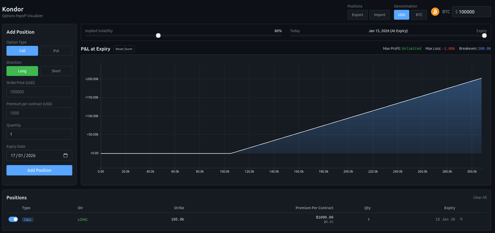

# Kondor

An options payoff visualizer for crypto traders. Try it out at [kondor.chadthackray.com](https://kondor.chadthackray.com).



## Features

- Visualize payoff curves for call and put options
- Support for multiple positions in a single portfolio
- Black-Scholes pricing
- Dual denomination support (USD and BTC-settled options)
- Time-decay analysis with adjustable days-to-expiry
- Interactive charts with zoom and pan
- Import/export positions as JSON
- Data persists in browser localStorage

## Self-Hosting

### Prerequisites

- Node.js 18+
- npm

### Build and Run

```bash
npm run dev
```